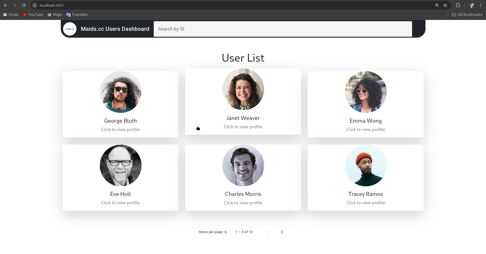
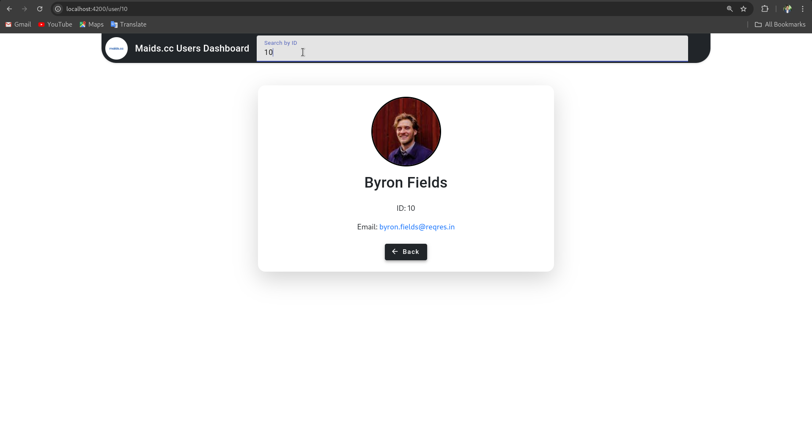
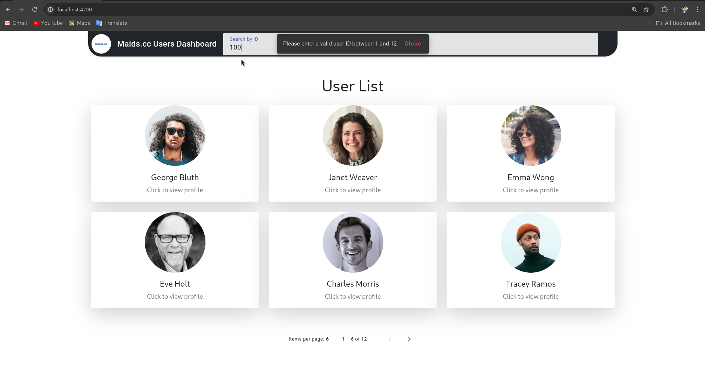
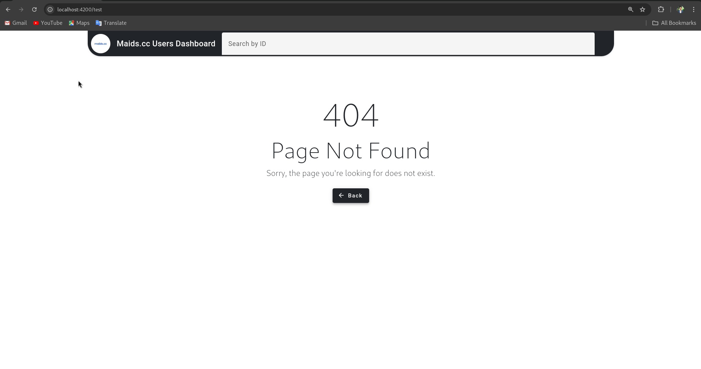

# Maids.cc Users Dashboard

Maids Dashboard is a web application for managing user information. It is built using Angular as the framework and NgRx for state management, providing a robust and responsive interface for handling user details.

## Table of Contents

- [Installation](#installation)
- [Usage](#usage)
- [Features](#features)
- [Contributing](#contributing)
- [License](#license)

## Installation

To get started with Maids Dashboard, follow these steps:

1. **Clone the repository:**
    ```sh
    git clone https://github.com/ahmedgalal2001/maids.cc.git
    cd maids.cc
    ```

2. **Install the dependencies:**
    ```sh
    npm install
    ```

3. **Run the application:**
    ```sh
    ng serve
    ```

4. **Open your browser** and navigate to `http://localhost:4200` to view the application.

## Usage

### User Details Component

The User Details component presents comprehensive information about a user, including:

- **Avatar**: Displays the user's profile picture.
- **Name**: Shows the user's full name.
- **ID**: Unique identifier for the user.
- **Email**: The user's email address.

Additionally, the component features a loading spinner that appears while user data is being fetched.

#### Template

Here is a sample of the User Details component template:

## Home Page


## Search Page


## Handle Search


## Not Found Page
